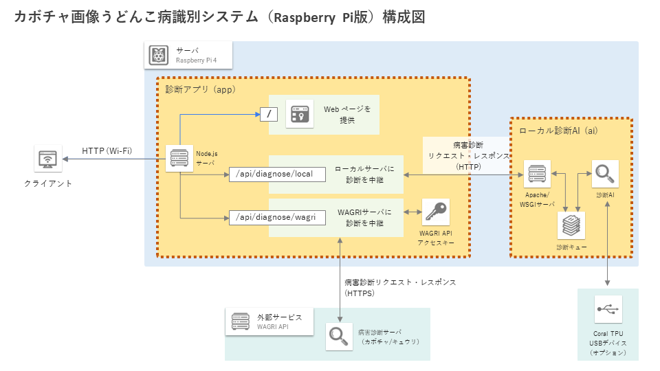

# カボチャ画像うどんこ病識別システム（Raspberry Pi版）


## 作業の手引き

* **うどんこ病を診断する**には...  
  * [診断のしかた](docs/usage_guide.md) をご参照ください。
* **Wi-Fi の設定 (SSID) を変更する**には...  
  * [Wi-Fi アクセスポイントの設定](docs/configure_wifi.md) をご参照ください。
* **ブート用イメージをSDカードに書き込む**には...  
  * [ブート用イメージの書き込み](docs/burn_bootable_image.md) をご参照ください。
* **ソースコードを、既存の Raspberry Pi 等のサーバに展開する**には...
  * [ソースコードの展開](docs/deploy_from_source.md) をご参照ください。
* **オフライン地図の表示地域を変更する**には...  
  * [OpenStreetMap オフライン地図の作成](docs/create_offline_map.md) をご参照ください。
* **変更したソースコードをブート用イメージとして再配布する**には...  
  * [ブート用イメージの作成](docs/create_bootable_image.md) をご参照ください。


## 概要

このシステムは、 カボチャ画像からうどんこ病の有無を診断し、その結果を Web UI 上の地図に表示するアプリケーションです。

うどんこ病の診断には画像分類 AI を用いており、下記の AI モデルから選択できます。

* Raspeberry Pi 上で動作する軽量AIモデル
* [農業データ連係基盤 (WAGRI)](https://wagri.net/ja-jp/) が提供する病虫害診断AI API（利用契約が必要）


## 環境構築

### 事前準備

下記の環境・ソフトウェアを用意してください。

* Raspberry Pi 4 Model B (8GB) またはそれ以上のスペック
* [Docker Engine](https://docs.docker.com/engine/install/) (version 20.10.7 以上)

下記のハードウェアは必須ではありませんが、併用することで診断を高速化できます。

* [Coral USB Accelerator](https://coral.ai/products/accelerator)（USB接続のAIアクセラレータ）

本システムは、WAGRI の病害虫診断APIを使用することができます。
WAGRI を利用する場合は、利用申請を行い、下記のアカウント情報を用意してください。

* WAGRI API のクライアントID、クライアントシークレット（アクセストークン認証）
* WAGRI API のベンダーID（`Authorization` ヘッダに入力する値）

### ローカル環境での環境構築

1. レポジトリ一式をクローンします（`git clone`）。
1. WAGRI アカウント等の機密情報は、別ファイル（シークレット）として管理しています。
  下記コマンドを実行し、シークレットファイルを追加します。
	```console
	$ cd /path/to/this/repo
	$ cd app/
	$ ./create_secret_skeleton
	```
	`./secret` ディレクトリ以下に下記ファイルが作成されます。
	各ファイルに、ID・シークレットを入力して保存します（行末は**改行しません**）。
	* `wagri_api_client_id`: クライアントID
	* `wagri_api_client_secret`: クライアントシークレット
	* `wagri_api_vendor_id`: ベンダーID
	* `auth`: Basic認証のユーザ名とパスワード (JSON形式)
		```json
		{
			"username1": "password1",
			"username2": "password2"
		}
		```
1. Docker コンテナの起動コマンドを実行します。
	```console
	$ docker-compose up --build
	```
	ブラウザで `http://localhost:3000` を開くと、システムの Web UI が表示されます。


## 単体テスト（ローカル環境）

`app` サーバの各機能に対して、単体テストを実装しています。
テストは、下記コマンドで実行できます。

```console
$ cd /path/to/this/repo/
$ docker compose -f docker-compose.yml -f docker-compose.test.yml up --build
...
naro_pumpkin-app-1  | Test Suites: 2 passed, 2 total
naro_pumpkin-app-1  | Tests:       2 passed, 2 total
naro_pumpkin-app-1  | Snapshots:   0 total
naro_pumpkin-app-1  | Time:        34.839 s
naro_pumpkin-app-1  | Ran all test suites.
```


## 設定変更手順

### Wi-Fi アクセスポイントの設定 (SSID, パスワード)

[Wi-Fi の設定を変更する](docs/configure_wifi.md) を参照してください。

### Basic 認証の設定

`app/secret/auth/auth` で設定しています。上記「ローカル環境での環境構築」を参照してください。

### WAGRI サーバの初期設定（アクセストークン等）

`app/secret` 以下の各ファイルで設定しています。上記「ローカル環境での環境構築」を参照してください。

### WAGRI サーバ接続先の設定

`app/src/app.config.js` を編集することで、WAGRI サーバの設定を変更できます。

* `classifierName`: 診断先のAPIサーバ。下記のうち1つを指定。
	* `'naroPumpkinV1'`: 農研機構カボチャ診断器（V1）
	* `'hoseiCucumberV4'`: 法政大学キュウリ診断器（V4）

### CPU / TPU の選択

使用するアクセラレータ（CPU / TPU）は、`ai/src/model/lib/efficientnetv2.py` で変更できます。
アクセラレータごとに、異なるモデルファイルを指定する必要があります。

ファイルをテキストエディタで開き、下記のとおり設定してください。

* CPU を使用する場合
	* `model_type = 'tflite'`
	* `tflite_path = '/var/www/maff_ai/src/model/bin/20221210_1004_ev2hub_ep30/model_lite.tflite'`
* TPU を使用する場合
	* `model_type = 'edgetpu'`
	* `tflite_path = '/var/www/maff_ai/src/model/bin/20221210_1004_ev2hub_ep30/model_edgetpu.tflite'`


## システム構成

このシステムは、下記の要素で構成されます。

* Web アプリおよび中継サーバ
* オフライン診断用 AI



以上