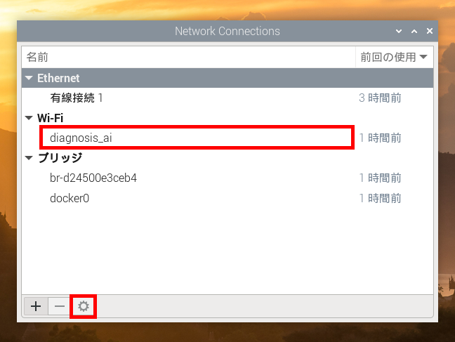
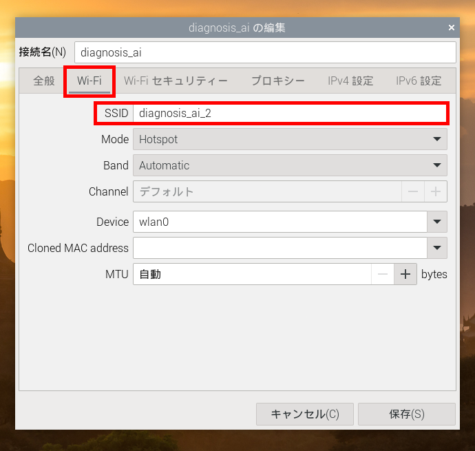
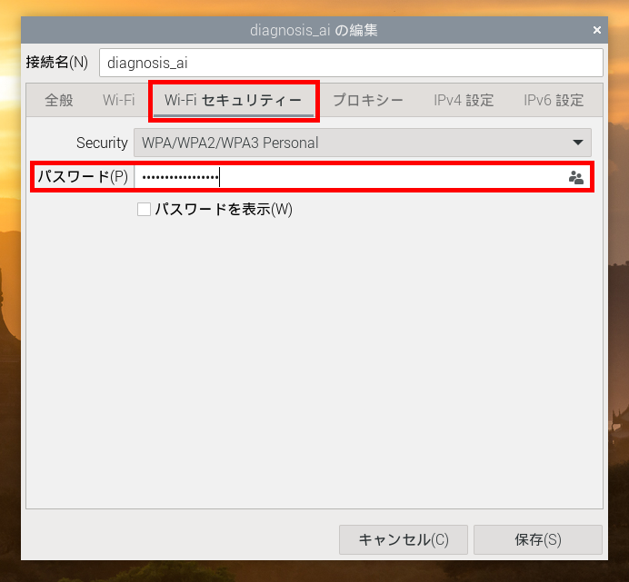
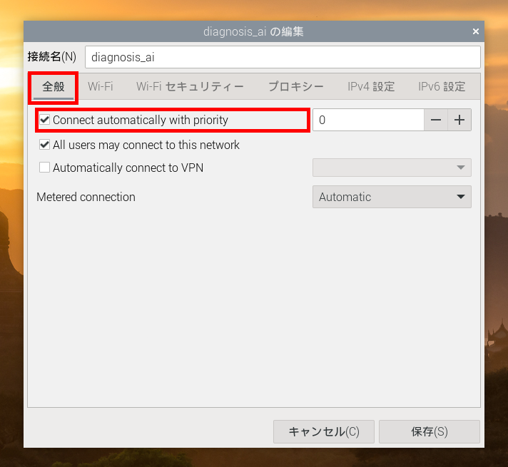
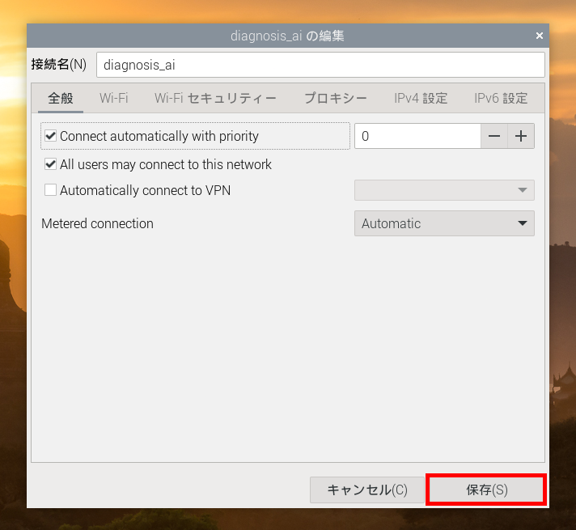
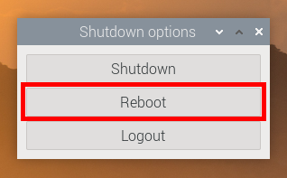
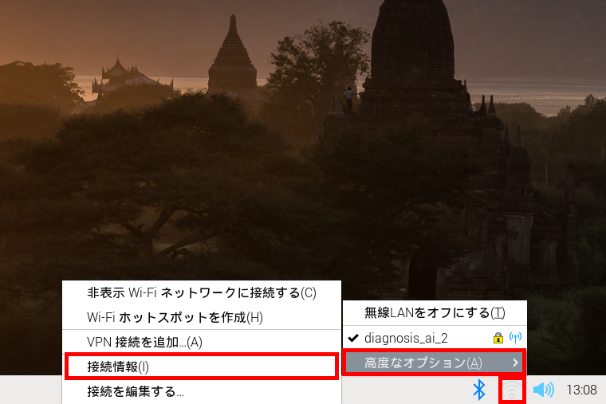
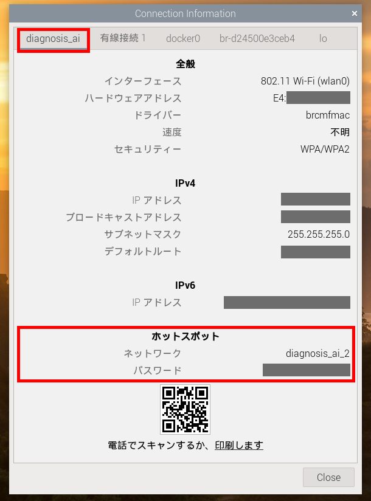

# Wi-Fi の設定（SSID、パスワード）を変更する

診断装置に Wi-Fi 接続する際に使う SSID とパスワードを変更する方法を説明します。

## 用意するもの

* 正しく動作する診断装置
* キーボートとマウス（USB 接続）
* ディスプレイ（HDMI 接続）と micro HDMI - HDMI 変換アダプタ

## 設定方法

1. キーボード、マウス、ディスプレイを診断装置に接続します。  
2. 診断装置に電源ケーブルを接続し、起動します。しばらく待つと、デスクトップ画面が表示されます。  
  
3. 画面右下の Wi-Fi アイコン（扇状に曲がった3本線のアイコン）をクリックし、「高度なオプション」→「接続を編集する」を選択します。  
  
4. ネットワーク一覧画面から、「Wi-Fi」の下にある「diagnosis_ai」を選択し、「編集」（歯車のアイコン）ボタンを選択します。  
  
5. 「Wi-Fi」タブを開き、「SSID」欄に新しい Wi-Fi の SSID を入力します。  
  
6. パスワードを変更する場合は、「Wi-Fi セキュリティー」タブを開き、「パスワード」欄に新しいパスワードを入力します。  
  
7. 「全般」タブを開き、「Connect automatically with priority」にチェックが入っていることを確認します。  
  
    > ⚠️注意⚠️
    >
    > 「Connect automatically with priority」にチェックが入っていないと、診断装置に電源を入れても Wi-Fi 接続できなくなります。
8. 「保存」ボタンをクリックし、設定を保存します。ネットワーク一覧画面も閉じます。  
  
9. 画面左下のスタートメニュー（木いちごのアイコン）をクリックし、「ログアウト」→「Reboot（再起動）」を選択して再起動します。  
  
  

再起動後、お使いの PC 等から Wi-Fi 接続し、診断装置にアクセスできることを確認してください。

> 📒 ノート
>
> microSD カードにディスクイメージを書き込み直すと、Wi-Fi 設定は元に戻ります。

## 設定の確認方法

同様の手順で、現在の Wi-Fi 設定（SSID とパスワード）を確認できます。

1. 診断装置にキーボード、マウス、ディスプレイを接続して起動します。
2. 画面右下の Wi-Fi アイコンをクリックし、「高度なオプション」→「接続情報」を選択します。
  
3. 「diagnosis_ai」タブを選択します。  
  

「ホットスポット」欄の下に、現在の Wi-Fi の SSID とパスワードが表示されます。

## 設定方法（CLI）

> 📒 ノート
>
> この手順は、Linux のコマンドラインインターフェース（CLI）に慣れている方向けです。

Wi-Fi 設定は `NetworkManager` の `diagnosis_ai` プロファイルで管理しています。
プロファイル設定ファイルを編集することで、SSID とパスワードを変更できます。

1. Raspberry Pi にキーボード、マウス、ディスプレイを接続して起動し、ターミナルを開きます。
2. `/etc/NetworkManager/system-connections/diagnosis_ai.nmconnection` ファイルを編集します。
    ```console
    $ sudo vi /etc/NetworkManager/system-connections/diagnosis_ai.nmconnection
    ```
3. `diagnosis_ai.nmconnection` ファイルの `[wifi]` と `[wifi-security]` セクションで SSID とパスワードを設定します。
    ```ini
    ...

    [wifi]
    band=bg
    channel=7
    mode=ap
    ssid=<新しいSSID>

    [wifi-security]
    key-mgmt=wpa-psk
    pairwise=ccmp
    proto=rsn
    psk=<新しいパスワード>

    ...
    ```
    > ⚠️注意⚠️
    >
    > `[connection]` セクションの `id` は変更しないでください。
    
    > 📒 ノート
    >
    > その他の設定項目については、`nm-settings-nmcli` の manpage を参照してください。
3. `NetworkManager` サービスを再起動して、変更を適用します。
    ```console
    $ sudo systemctl restart NetworkManager
    ```

再起動後、お使いの PC 等から Wi-Fi 接続し、診断装置にアクセスできることを確認してください。

以上
