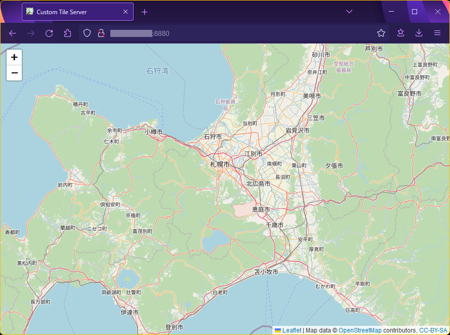

# OpenStreetMap オフライン地図（PMTiles）の作成

この手順書では、OpenStreetMap の地図データをダウンロード・変換して、オフライン地図表示できるようにする方法を説明します。

## 概要

このシステムでは、地図データの一部がオフライン表示できます。
オフライン表示を実現するため、OpenStreetMap からラスタタイル画像を生成し、[PMTiles](https://github.com/protomaps/PMTiles) 形式のファイルとしてアーカイブしています。

この手順書に沿って作業することで、ほかの地域の地図データをオフライン表示できます。

## 動作環境

PMTiles の作成は Linux 環境上で行います。下記の環境をご用意ください。

* Ubuntu 20.04 LTS
* Docker Engine 24.0.7 以上 ([link](https://docs.docker.com/engine/install/ubuntu/))
* Node.js v18.18.2 以上 ([link](https://nodejs.org/en/download))

## 手順

### OSM PBF ファイルのダウンロード

オフライン表示したい地域の OSM PBF ファイルをダウンロードします。

OpenStreetMap 公式 Web サイトからダウンロードできるのは地球全体（Planet）のデータのみです。
地域ごとのデータ（**Extracts** とよばれます）は第三者が提供しています。

ここでは、**Geofabrik GmbH** 社が提供する Extracts からデータをダウンロードします。
下記手順では北海道地域を例に説明していますが、別の地域（Subregion) を選択することで、ほかの地域のデータをダウンロードすることができます。

1. 日本の地域データをダウンロードするため、[Geofabrik の日本地域ダウンロードページ](https://download.geofabrik.de/asia/japan.html) にアクセスします。
2. "Sub Regions" から "Hokkaidō" を選択します。
3. "Commonly Used Formats" から `hokkaido-latest.osm.pbf` を選択し、ダウンロードします。

### ラスタタイル提供サーバの構築

ダウンロードした PBF ファイルを使って、ラスタタイル提供サーバを構築します。
なお、サーバの構築手順は Switch2OSM ([link](https://switch2osm.org/serving-tiles/using-a-docker-container/)) を参照しています。

```console
$ # OSM PBF ファイルをダウンロードしたディレクトリに移動
$ ls
hokkaido-latest.osm.pbf

$ # ボリュームを作成
$ docker volume create osm-data
osm-data

$ # タイルデータをインポート
$ # `/path/to/hokkaido-latest.osm.pbf` は、ダウンロードした OSM PBF ファイルのパスを指定
$ # 処理には数十分～数時間かかります
$ docker run \
    -v /path/to/hokkaido-latest.osm.pbf:/data/region.osm.pbf \
    -v osm-data:/data/database/ \
    overv/openstreetmap-tile-server import

$ # タイルサーバを起動
$ docker run \
    -p 8880:80 \
    -v osm-data:/data/database \
    overv/openstreetmap-tile-server run

$ # サーバの起動に失敗した場合は、下記を実行してボリュームを一度消去
$ docker volume rm osm-data
osm-data
```

Web ブラウザから `<タイルサーバのIPアドレス>:8880` にアクセスすると、OpenStreetMap と同様のスタイルで地図が表示されます。
タイル画像の URL は `<タイルサーバのIPアドレス>:8880/tile/{z}/{x}/{y}.png` です。



### タイルのスクレイピング

設置したローカルサーバからタイルをスクレイピングし、MBTiles に変換します。

スクレイピングおよび変換には [xyz-to-mbtiles](https://github.com/vokkim/xyz-to-mbtiles) を用います。
このツールは、ラスタタイルサーバにアクセスしてタイルを収集し、MBTiles に変換することができます。

```console
$ # ツールを GitHub からクローン
$ git clone https://github.com/vokkim/xyz-to-mbtiles

$ # ライブラリをインストール
$ cd xyz-to-mbtiles/
$ npm install
...
added 122 packages, and audited 123 packages in 1m
```

`npx xyz-to-mbtiles` を実行することで、MBTiles 形式でタイルを保存できます。

* `--input` には、ラスタタイル提供サーバの URL を指定します。
* `--output` には、出力ファイル名を指定します。
* `--retry` には、タイルの取得リトライ回数を指定します。
* `--minzoom` には、最小ズームレベルを指定します。
* `--maxzoom` には、最大ズームレベルを指定します。
* `--bbox West,South,East,North`（バウンディングボックス）を指定することで、一部地域だけを MBTiles に変換することができます。

コマンド実行例:

```console
$ npx xyz-to-mbtiles \
    --input 'http://localhost:8880/tile/{z}/{x}/{y}.png' \
    --output 'assabu.mbtiles' \
    --retry 3 \
    --minzoom 4 \
    --maxzoom 17 \
    --bbox '140.25,41.85,140.35,41.95'
Requested bounds: [ 140.25, 41.85, 140.35, 41.95 ]
Headers:  {}
Insert metadata ...
Fetching level 4 tiles: 14-14 x 5-5
Total size 1 x 1 = 1 tiles
Row 4 1/1 done
Fetching level 5 tiles: 28-28 x 11-11
Total size 1 x 1 = 1 tiles
Row 5 1/1 done
Fetching level 6 tiles: 56-56 x 23-23
Total size 1 x 1 = 1 tiles
Row 6 1/1 done
...
Row 16 24/25 done
Row 16 25/25 done
DONE
Remaining errors: 0
```

> ⚠️注意⚠️
>
> * 広範囲をスクレイピングする場合や、最大[ズームレベル](https://wiki.openstreetmap.org/wiki/Zoom_levels)（`--maxzoom`）の値が大きい場合、タイルの生成が完了するまで長時間かかります。
> 例えば、本レポジトリ付属の北海道地域タイル（ズームレベル1～17）の場合、ワークステーション上での処理時間は**37時間**でした。
> スクレイピングを実行する際は、事前に範囲を絞ってテストすることをお勧めします。
> * MBTiles のファイルサイズは、スクレイピングした範囲に依存します。例えば北海道地域の MBTiles ファイルは **11GB**になります（なお、PMTiles に変換後のファイルサイズは半分程度に減少しました）。処理実行時には、十分なディスク容量を確保してください。

### MBTiles から PMTiles への変換

MBTiles から PMTiles への変換には、[protomaps/go-pmtiles](https://github.com/protomaps/go-pmtiles) を使用します。

1. [リリースページ](https://github.com/protomaps/go-pmtiles/releases) から、最新のバイナリをダウンロードします。
2. `pmtiles` コマンドを実行し、MBTiles から PMTiles に変換します。
    ```console
    $ cd /path/to/go-pmtiles

    $ ./pmtiles convert /path/to/assabu.mbtiles /path/to/assabu.pmtiles
    2024/02/14 09:41:53 convert.go:260: Querying total tile count...
    2024/02/14 09:41:53 convert.go:276: Pass 1: Assembling TileID set
    100% |█████████████████████████████████████████████████████████████████████████████████████████████████████████████| (675/675, 1102734 it/s)
    2024/02/14 09:41:53 convert.go:310: Pass 2: writing tiles

    100% |████████████████████████████████████████████████████████████████████████████████████████████████████████████████| (675/675, 4354 it/s)
    2024/02/14 09:41:53 convert.go:364: # of addressed tiles:  675
    2024/02/14 09:41:53 convert.go:365: # of tile entries (after RLE):  652
    2024/02/14 09:41:53 convert.go:366: # of tile contents:  615
    2024/02/14 09:41:53 convert.go:388: Total dir bytes:  1774
    2024/02/14 09:41:53 convert.go:389: Average bytes per addressed tile: 2.63
    2024/02/14 09:41:53 convert.go:359: Finished in  191.635697ms
    ```

PMTiles のデータは、[PMTiles Viewer](https://protomaps.github.io/PMTiles/) にドラッグ＆ドロップすることで確認できます。

### PMTiles の差し換え

PMTiles に変換したファイルを、本レポジトリ以下の `app/src/public/basemap/hokkaido.pmtiles` に配置することで、作成した地図データをオフライン表示できるようになります。

ファイル名を変更する場合は、`app/src/public/index.js` に定義されているファイルパスを適宜変更してください。

以上