# 診断のしかた

ここでは、**診断装置を起動・終了する方法**と、**スマートフォンやPCから診断画面を開いて病虫害を診断する方法**を説明します。

## 装置の起動と終了

### 装置の電源を入れるには

1. 装置（Raspberry Pi）裏面のカードスロットに、microSD カードを装着します。  
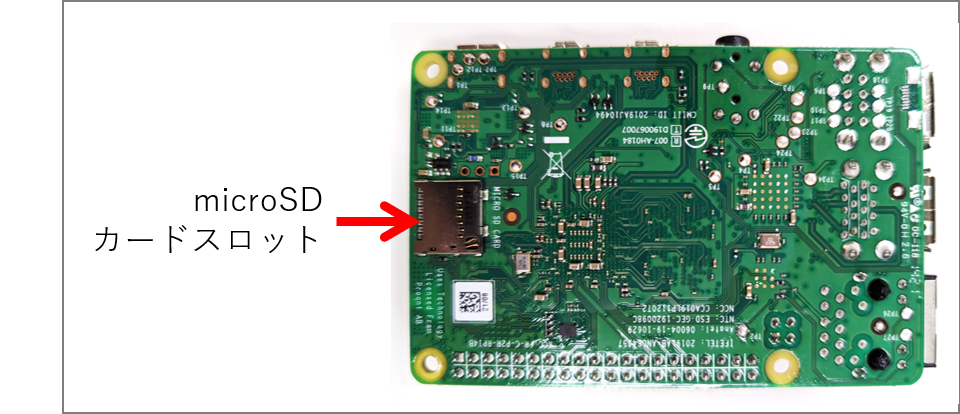
1. 電源ポートに、電源プラグを差し込みます。  
  ※ 電源ポートは、装置の側面にあります。形状は USB Type-C です。  
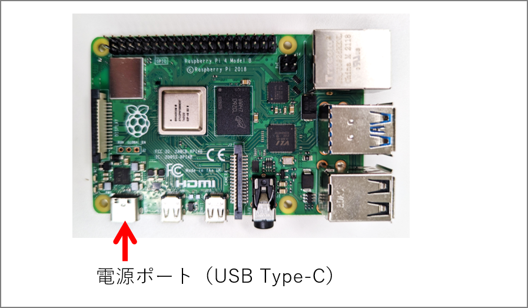
1. 電源ランプ（基板上の赤いランプ）が点灯し、装置が起動します。  
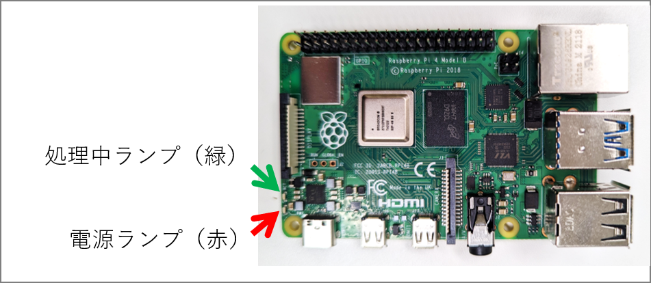
1. 1分ほど待つと、Wi-Fi 接続ができる状態になります。

### 装置の電源を切るには

診断中に電源を切ると、microSDカード上のデータが壊れる可能性があります。診断を行っていないことを確認してから、電源を切ってください。

1. 装置に接続しているPCやスマートフォン上で、診断が行われていないことを確認します。
1. 処理中ランプ（基板上の、緑のランプ）が消灯していることを確認します。

    > ⚠️注意⚠️
    > 
    > 緑のランプが点滅しているときに装置の電源を切ると、microSDカード上のデータが壊れ、
    > **装置が正しく動作しなくなる**場合があります。
    > 
    > 万が一、装置が動作しなくなったら、[ブート用イメージの書き込み](./burn_bootable_image.md) で示した手順に沿って
    > microSD カードにデータを書き込み直してください。

1. 電源プラグを抜きます。
1. 装置の電源が切れて、電源ランプが消灯します。

## PCやスマートフォンを使ってうどんこ病を診断する

### 事前準備: 装置に Wi-Fi 接続する

病虫害診断をする前に、PCやスマートフォンから識別装置に Wi-Fi（無線LAN）接続する必要があります。

> ⚠️注意⚠️
>
> * お使いの端末によっては、ここで示した Wi-Fi の設定手順が当てはまらない場合があります。
> * 識別装置に接続しているあいだは、PCやスマートフォンからインターネットへの接続ができません。  
> Wi-Fi 接続を解除すると、再度インターネットに接続できるようになります。  
> （装置に接続したまま、インターネットに接続することはできません。）

#### Windows PC の場合

1. 接続済みの Wi-Fi ネットワークがある場合は切断します。有線LAN接続している場合は、LANケーブルを抜きます。
1. タスクバーのネットワークアイコンをクリックし、Wi-Fi アイコン（扇形に広がる3本線のアイコン）の隣にある「Wi-Fi 接続の管理」（> アイコン）をクリックします。  
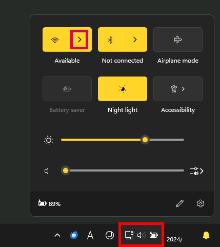
1. 一覧から「`pumpkin_ai`」という名前の項目を選択します。  

1. 「自動的に接続」のチェックを外し、「接続」ボタンをクリックします。  
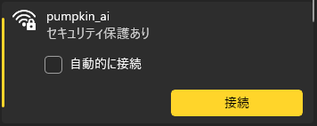
1. はじめて接続するときは、パスワードを入力する必要があります。「ルータのラベルに記載されている PIN を入力してください」と表示される場合は、「セキュリティキーを使用して接続」を選択します。  
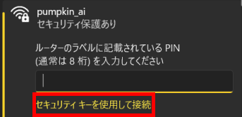
1. 別途指定されたパスワードを入力します。  
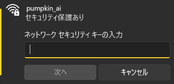

#### Android の場合

1. 「設定」アプリ（⚙アイコン）を開きます。  
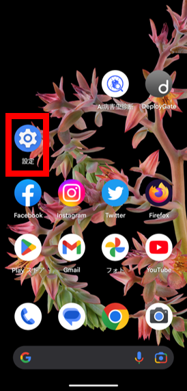
1. 「ネットワークとインターネット」を開きます。  
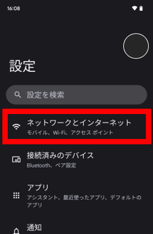
1. 「インターネット」を開きます。  
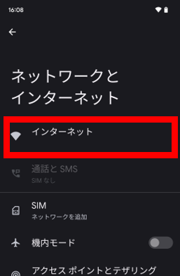
1. 「Wi-Fi」のスイッチがOFFになっているときは、ONにします。  
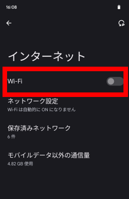
1. 一覧から「`pumpkin_ai`」という名前の項目を選択します。  
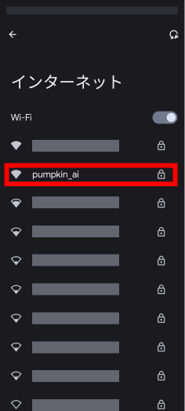
1. はじめて接続するときは、パスワードを入力する必要があります。
別途指定されたパスワードを入力します。  
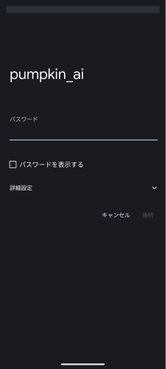
1. しばらく待つと、「接続済み」と表示されます。  
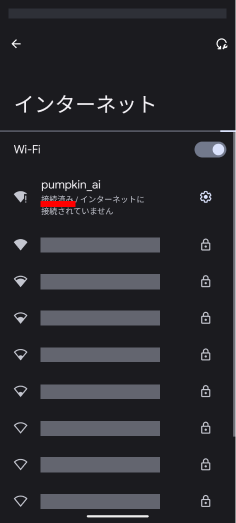

#### iPhone の場合

1. 「設定」アプリ（⚙アイコン）を開きます。
1. 「Wi-Fi」を開きます。
1. 一覧から「`pumpkin_ai`」という名前の項目を選択します。
1. はじめて接続するときは、パスワードを入力する必要があります。
別途指定されたパスワードを入力します。

Raspberry Pi がインターネット接続されていない場合は、「インターネットに接続されていない」というメッセージが表示されることがあります。
この場合、一部の機能（WAGRI モデルの利用、地理院地図/OpenStreetMapの表示）が制限されますが、オフラインモデルでの診断は可能です。

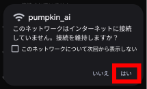

### 診断するまえに

診断する画像は、位置情報が付与されたJPEGファイル（拡張子が `.jpg` または `.jpeg`）としてください。
位置情報がなくても診断できますが、診断結果は地図上に表示されず、CSV データをダウンロードして結果を確認する必要があります。

あらかじめ、診断用の画像を1つのフォルダにまとめておくと、複数の画像を選んで診断する際に便利です。

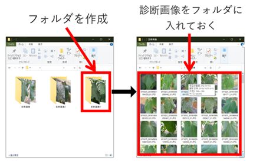

### 診断画面を開く

1. Google Chrome や Safari などのブラウザを起動します。  
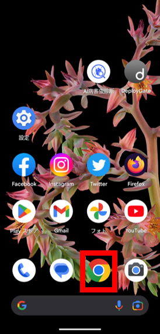
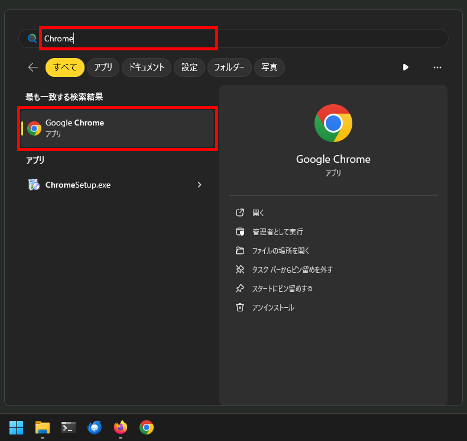
1. アドレスバーに下記を入力して、キーボードの確定キーを押します。  
`http://192.168.10.1`  

接続時、ログイン画面が表示される場合があります (Basic 認証)。
システム管理者から指示されたユーザ名とパスワードを入力してください。

### 画像を診断する

> ⚠️ 注意
>
> * Raspberry Pi がインターネットに接続されていない場合は、下記の機能のみ利用できます。
>   * オフラインモデルでの診断、診断結果の表示とCSV出力
>   * OpenStreetMap (オフライン版) の表示（北海道のみ）

診断システムのメイン画面が表示されます。

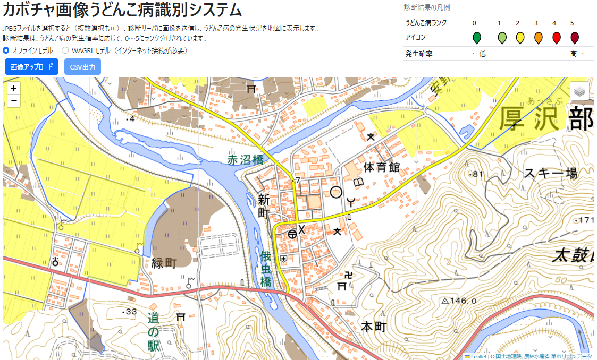

画面の上部にあるボタンを使って、診断に使うAIを選択できます。

* **オフラインモデル**: Raspberry Pi のなかで動作するAIモデルです。Raspberry Pi がインターネットに接続していなくても診断できます。
* **WAGRI モデル**: [農業データ連係基盤 (WAGRI)](https://wagri.naro.go.jp/) が提供する病虫害診断AIを使います。事前の利用契約と設定が必要です。また、Raspberry Pi がインターネットに接続されている必要があります。

メイン画面の「画像アップロード」ボタンを押して、フォルダ選択画面を開きます。

診断画像を選択し（複数選択可）、「アップロード」ボタンを押すと、診断がはじまります。 

> ⚠️ 注意
>
> * JPEG 画像以外の画像は診断できません。
> * 診断画像が多いときや、WAGRI サーバが混雑しているときは、診断完了までに時間がかかります。

撮影画像ごとに、診断結果を示すアイコンが地図上に表示されます。

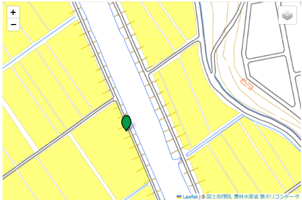

アイコンは、診断AIが判断したうどんこ病の発生レベルによって色分けされます：

|発生レベル|0|1|2|3|4|5|
|-|-|-|-|-|-|-|
|アイコン|||||||

アイコンをクリックすると、撮影した画像やうどんこ病の発生レベルを確認できます。

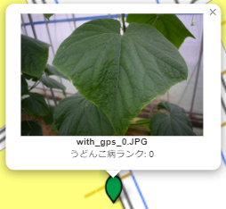

### 診断結果をダウンロードする

メイン画面の「CSV出力」ボタンを押すと、診断結果をCSV形式でダウンロードすることができます。

診断結果の例を下記に示します。

|ファイル名|経度|緯度|うどんこ病ランク|
|-|-|-|-|
|file1.JPG|37.123456|138.987654|5|
|file2.JPG|38.987654|139.123456|0|

以上